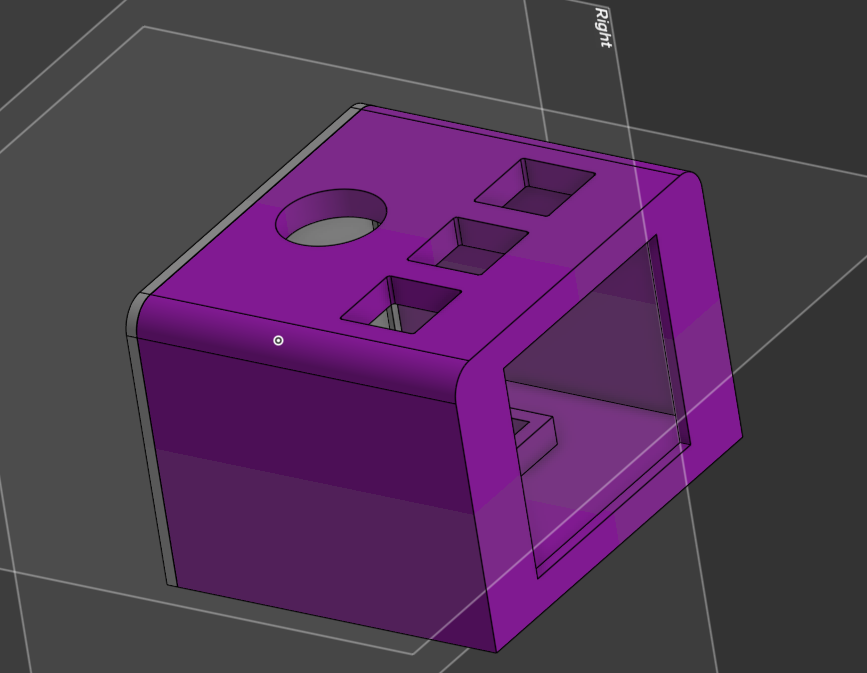
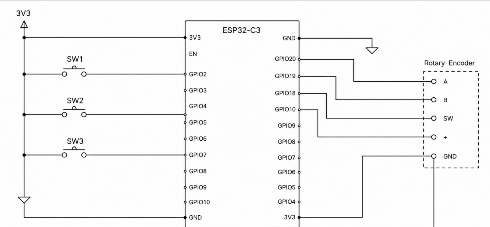

# Spotify_Display

A custom design of a working spotify display involving CAD and FIRMWARE

This design is made to have a spotify shortcut in my desk as an extra accesory.

Im using components such as 
ESP32
ST7735 Display
3 Keyboard switches
Rotary Encoder

Onshape: https://cad.onshape.com/documents/f169e4631242b541b10ba23a/w/343e9d0f67318a61d52886f7/e/16c6dbc529c8f1c04a9b5ac5?renderMode=0&uiState=6a396909db39404c24669ed3

|Item                        |Description                        |Quantity|Unit Price ($)|Total Price ($)|URL                                                 |Running Total|
|----------------------------|-----------------------------------|--------|--------------|---------------|----------------------------------------------------|-------------|
|ESP32                       |Microcontroller                    |1       |8.66          |8.66           |https://es.aliexpress.com/item/1005011634379711.html|8.66         |
|M3                          |Heat Insert                        |1       |0.99          |0.99           |https://es.aliexpress.com/item/1005008086167973.html|7.65         |
|ST7735                      |Display                            |1       |6.60          |6.60           |https://es.aliexpress.com/item/1005010427614707.html|14.25        |
